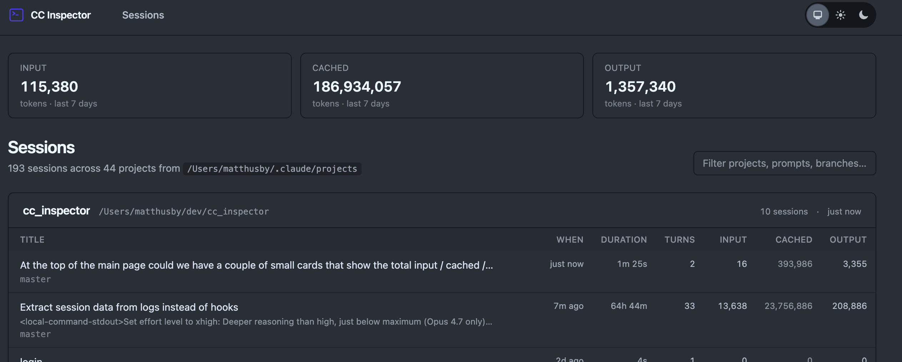

# CC Inspector

A local Phoenix LiveView app for browsing your [Claude Code](https://claude.com/claude-code) session history.

It reads the JSONL transcripts Claude Code already writes to `~/.claude/projects/` and renders them as a navigable, live-updating UI. There's no database, no hooks to install, and nothing to configure — point it at your machine and start it.



## What you get

- **Token usage at a glance** — input / cached / output totals across the last 7 days, summed across every session.
- **Sessions index** — every session on disk, grouped by project, sorted by most recent activity. Each row shows the AI-generated title (when present), first user prompt, branch, duration, turn count, and per-session token usage.
- **Session detail** — the full conversation rendered turn-by-turn: user prompts, assistant text, thinking blocks (with an "encrypted" pill for redacted thinking from newer models), and paired tool calls + results with pretty-printed input and output. Long assistant blocks collapse so you can scan a session quickly.
- **Filter** — type to narrow the list by project path, prompt text, branch, or session id.
- **Live updates** — a filesystem watcher picks up new turns as Claude writes them, so an open page re-renders while a session is in flight.

## Quick start

You'll need Elixir 1.15+ and Erlang/OTP installed.

```bash
git clone https://github.com/matthusby/cc_inspector.git
cd cc_inspector
mix setup
mix phx.server
```

Then open <http://localhost:4444>.

## Configuration

By default the app reads `~/.claude/projects`. If your transcripts live elsewhere, override the path in config:

```elixir
# config/dev.exs
config :cc_inspector, claude_projects_dir: "/path/to/projects"
```

The app only ever reads from this directory — it never writes to your Claude Code data.

## Development

```bash
mix setup       # fetch deps, install + build assets
mix phx.server  # http://localhost:4444
mix test        # run the test suite
mix precommit   # compile --warnings-as-errors, deps.unlock --unused, format, test
```

The test suite uses a sandboxed projects directory and writes synthetic JSONL transcripts, so it doesn't touch your real `~/.claude` directory.
